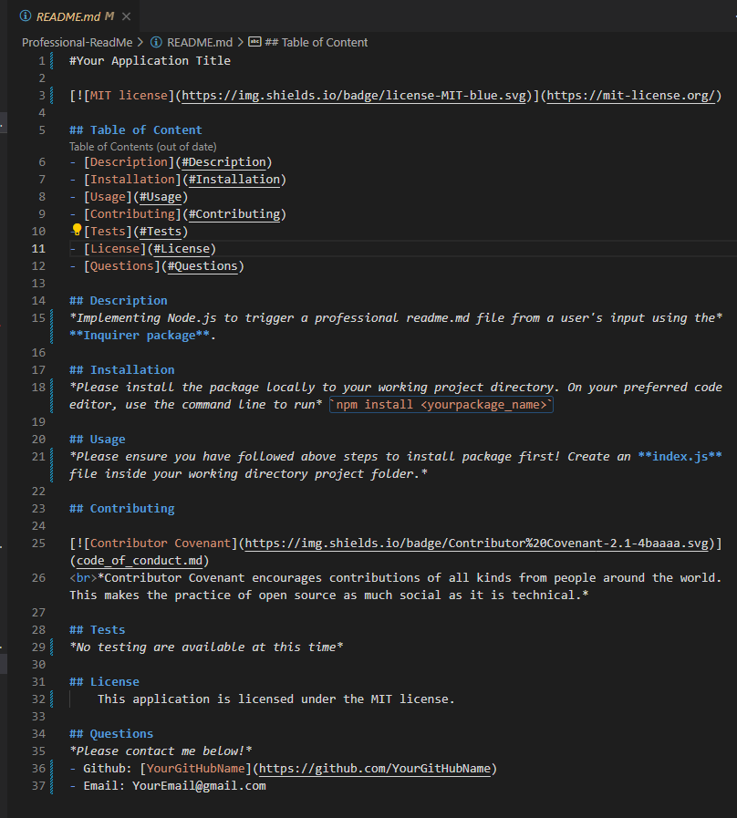
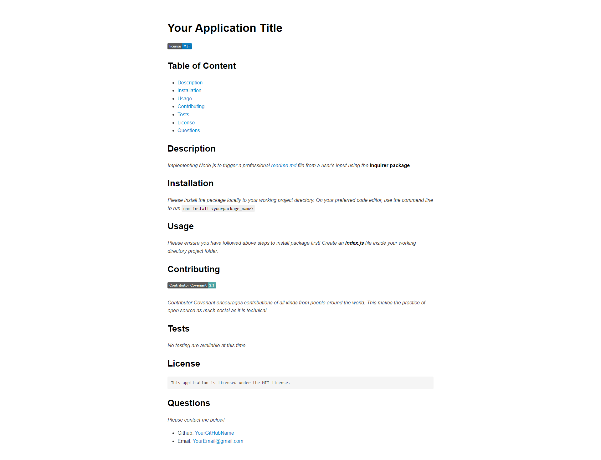

# Professional-ReadMe

## Table of Content
- [Table of Content](#table-of-content)
- [Description](#description)
- [Installation](#installation)
- [Usage](#usage)
- [Contributing](#contributing)
- [Tests](#tests)
- [License](#license)
- [Questions](#questions)

## Description
 *Implementing Node.js to trigger a professional readme.md file from a user's input using the* **Inquirer package**.
  
>GIVEN a command-line application that accepts user input
>
>WHEN I am prompted for information about my application repository
>
>THEN a high-quality, professional README.md is generated with the title of my project and sections entitled Description, Table of Contents, Installation, Usage, License, Contributing, Tests, and Questions
>
>WHEN I enter my project title
>
>THEN this is displayed as the title of the README
>
>WHEN I enter a description, installation instructions, usage information, contribution guidelines, and test instructions
>
>THEN this information is added to the sections of the README entitled Description, Installation, Usage, Contributing, and Tests
>
>WHEN I choose a license for my application from a list of options
>
>THEN a badge for that license is added near the top of the README and a notice is added to the section of the README entitled License that explains which license the application is covered under
>
>WHEN I enter my GitHub username
>
>THEN this is added to the section of the README entitled Questions, with a link to my GitHub profile
>
>WHEN I enter my email address
>
>THEN this is added to the section of the README entitled Questions, with instructions on how to reach me with additional questions
>
>WHEN I click on the links in the Table of Contents
>
>THEN I am taken to the corresponding section of the README

## Installation
***Please install the package locally to your working project directory.*** 
- On your preferred code editor, use the command line to run  
`npm install <yourpackage_name>`
- If there is a package.json file in the directory in which npm install is run, npm installs the latest version of the package that satisfies the semantic versioning rule declared in package.json.
- If there is no package.json file, the latest version of the package is installed.

## Usage
***Please ensure you have followed above steps to install package first!***
- Create an **index.js** file inside your working directory project folder. 
- Copy and paste the code below within your created **index.js** file.
`node index.js`
- Observe the result in the terminal. See the images and video below for demo. 

https://user-images.githubusercontent.com/117052258/212256792-b3804868-e4aa-4718-b369-88e446406f7a.mp4

## Contributing

 *Contributor Covenant encourages contributions of all kinds from people around the world. This makes the practice of open source as much social as it is technical.*

## Tests
*No testing are available at this time.*

## License
    This application is licensed under the Boost license.

## Questions
*Please contact me below!*
- Github: [JulienneJulien](https://github.com/JulienneJulien)
- Email: JulienneJulien15@gmail.com 
